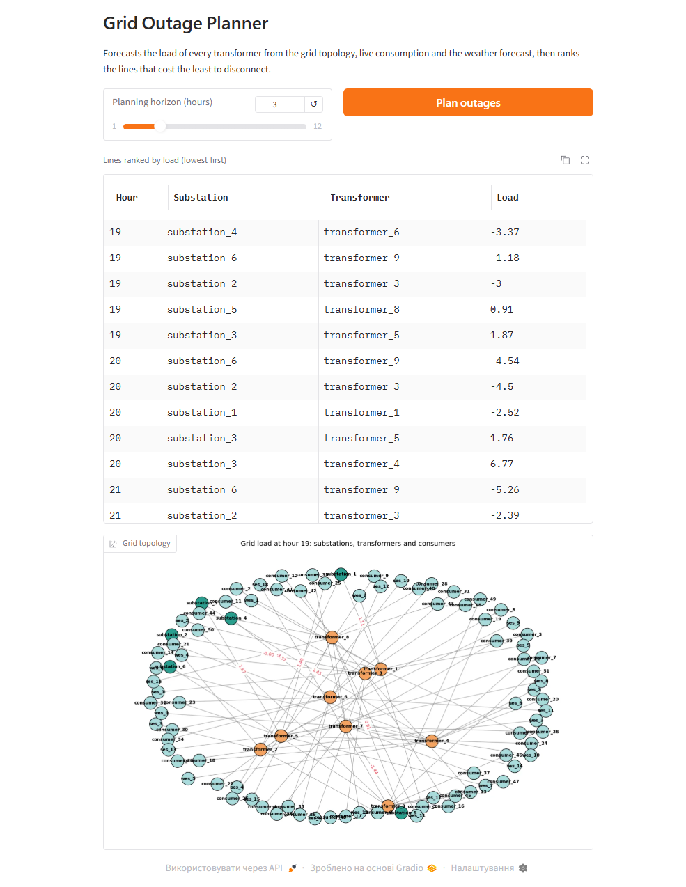
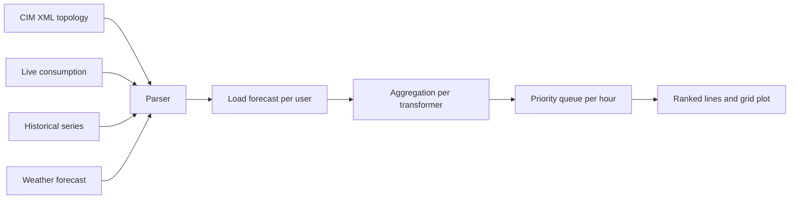

<div align="center">

# ⚡ Grid Outage Planner

### Decides which power lines to disconnect when the grid cannot serve everyone

Built at the **Cybersecurity Innovations Hackathon 2024** (team BugLords). The planner forecasts
transformer load from the grid topology, live consumption and the weather forecast, then ranks
the lines whose disconnection costs the least.

[](LICENSE)


</div>

---

## 🛠 Tech Stack

<div align="center">

**Core**<br>


**Interface and visualisation**<br>


**Data**<br>


</div>

---

## 🎬 Demo

<div align="center">


*Pick a planning horizon, get the lines ranked by load and the grid topology with the numbers on it.*

**[▶ Watch the full video](docs/demo.mp4)**

</div>

<details>
<summary><b>More screenshots</b></summary>

<br>



</details>

---

## 🚀 Quick Start

### Requirements

- Python 3.12+

### Run

```bash
git clone https://github.com/sergiyclas/grid-outage-planner.git
cd grid-outage-planner
python -m venv .venv && source .venv/bin/activate    # Windows: .venv\Scripts\activate
pip install -r requirements.txt
python interface.py
```

Open **http://localhost:7860**, choose a planning horizon and press *Plan outages*.

To run the planner without the interface:

```python
from main_func import line_offer

print(line_offer(3))     # ranking for the next 3 hours
```

---

## ✨ Features

### Forecasts load instead of reading it

Live consumption is compared against the same hour in the historical series to derive a per-user
factor, which is then applied to the historical curve for the coming hours. A user consuming 20%
above their usual level is expected to keep doing so.

### Understands the grid, not just the numbers

The topology is parsed from a **CIM** (IEC 61970) XML model: which consumers and generators hang
off which transformer, and which substation feeds it. Load is aggregated up that tree, with
generation subtracted from consumption.

### Ranks lines by what they actually cost

Each hour gets its own priority queue of transformers ordered by net load, so the planner answers
"disconnect these five first" rather than dumping raw numbers.

### Shows the grid

The topology is rendered with the computed load on every substation-transformer line, colour-coded
by node type, so a decision can be checked visually before it is applied.

### Weather-aware

The weather forecast feeds the generation side of the balance, which matters for a grid with
renewable sources whose output depends on conditions.

---

## 🏗 Architecture



**Pipeline**

1. `parsing.py` reads the CIM model and the JSON time series.
2. Per-user factors are derived from live versus historical consumption for the current hour.
3. The factors project the historical curve forward across the planning horizon.
4. Consumption and generation are aggregated per transformer, then per substation line.
5. Each hour is pushed into a priority queue; the lowest-load lines surface first.

**Project layout**

```
main_func.py     the planning pipeline
parsing.py       CIM XML and JSON time-series parsers
generators.py    synthetic live-consumption generator
algorithm.py     standalone script version of the pipeline
visualizator.py  grid rendering with NetworkX and Matplotlib
interface.py     Gradio interface
data/            CIM model, historical, current and weather data
```

---

## ⚙️ Data

| File | Content |
|:---|:---|
| `data/cim_model.xml` | Grid topology: substations, transformers, consumers, generators |
| `data/historical.json` | Hourly consumption and generation history |
| `data/current.json` | Live readings, regenerated on each run |
| `data/predict_weather.json` | Weather forecast driving the generation side |
| `data/tth.json` | Transformer throughput limits |

Results are written to `data/results_<timestamp>` on every run.

---

## 📬 Contact

**Serhiy Dzen** – AI Software Engineer

[](mailto:sergiyclas@gmail.com)
[](https://www.linkedin.com/in/sergiyclas/)
[](https://github.com/sergiyclas)

---

<div align="center">

Licensed under the [MIT License](LICENSE)

</div>
